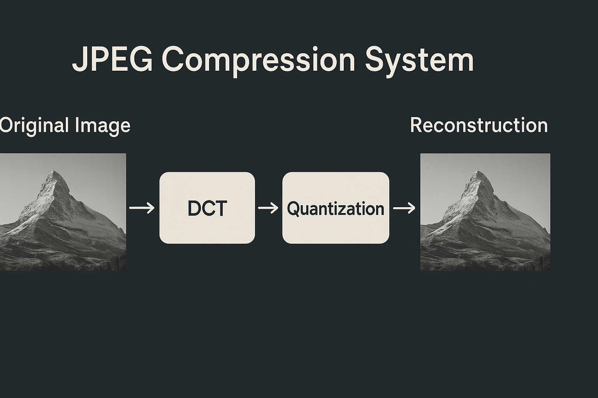

# JPEG Compression System

A **JPEG image compression system** for grayscale images, implemented in **Python** using **NumPy** and related libraries. This project demonstrates the core steps of JPEG compression, including encoding and decoding, and visualizes each stage to highlight the effectiveness of the compression and the accuracy of reconstruction.

---

## ✨ Features
- Compression of grayscale images using the **JPEG standard**.
- **Encoding pipeline**:
  - Block-based **Discrete Cosine Transform (DCT)**.
  - **Quantization** using a standard quantization matrix.
  - **Zig-zag scanning** for efficient entropy coding preparation.
- **Decoding pipeline**:
  - Inverse zig-zag scan.
  - Dequantization.
  - Inverse DCT to reconstruct the image.
- Visualization of each stage with **Matplotlib**:
  - Original image.
  - DCT coefficients.
  - Quantized blocks.
  - Reconstructed image.
- Flexible implementation for experimenting with different quantization matrices and compression levels.

---

## 🛠️ Technologies
- **Python**
- **NumPy**
- **SciPy**
- **PIL (Pillow)**
- **Matplotlib**
- **Jupyter Notebook**

---

